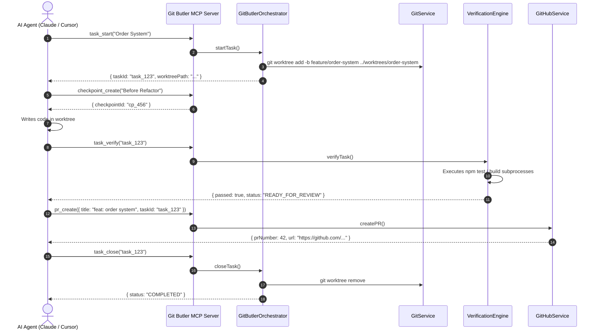

# Git Butler — Architecture & Design Invariants

This document outlines the core architecture, data flow, safety invariants, and security boundaries of Git Butler.

---

## 🏛️ Core Principles

### 1. AI is the Brain; Git Butler is the Hands
AI coding agents are exceptional at analyzing requirements, designing architectures, and writing code. However, letting agents execute raw, unconstrained shell Git commands leads to fatal mistakes:
- Overwriting uncommitted local changes
- Committing incomplete code directly onto `main`
- Hallucinating that test suites passed when they never ran
- Leaving orphaned `.git/index.lock` files after unexpected interruptions

Git Butler acts as the trusted execution layer. The agent decides **what** to do; Git Butler safely executes **how** to do it.

### 2. Never Fabricate Git State (Anti-Hallucination)
Git Butler treats the local Git repository and GitHub API as absolute ground truth:
- All git queries use porcelain output flags (`git status --porcelain=v2`, `git worktree list --porcelain`, `git for-each-ref`).
- Git Butler returns structured TypeScript data with zero conversational interpretation.
- Errors are returned as typed `GitButlerError` with actionable details (command, exitCode, stderr).

### 3. Tasks are Persistent; Worktrees are Disposable
- **Tasks (`.ai-git/tasks.json`):** Survive across process restarts, IDE reloads, and worktree cleanups. Tasks store requirement context, iteration counts, checkpoint logs, and PR links.
- **Worktrees:** Physical directories created on-demand for isolated feature development. When a task is closed, the worktree is deleted to free disk space, while all commits remain safe in the Git branch.

### 4. Protect User Work at All Costs
- Git Butler checks working tree status before destructive operations (restoring checkpoints, removing worktrees, closing tasks).
- If uncommitted changes exist, operations are blocked with `WORKTREE_DIRTY` unless the user or agent explicitly specifies `force: true`.

---

## 🔒 Permission Tiers & Safety Boundaries

Git Butler enforces 4 progressive permission tiers:

| Tier | Level | Allowed Operations | Typical Use Case |
| :--- | :---: | :--- | :--- |
| **`READ_ONLY`** | 1 | `git:status`, `git:diff`, `git:log`, `git:branch_list`, `task:list`, `checkpoint:list`, `verify:check`, `doctor:run` | Code exploration, codebase research |
| **`LOCAL_MUTATION`** | 2 | Tier 1 + `git:add`, `git:commit`, `git:checkout`, `git:branch_create`, `task:create`, `checkpoint:create`, `checkpoint:restore`, `worktree:create`, `worktree:remove_safe` | Standard autonomous coding agent |
| **`REMOTE_INTERACTION`**| 3 | Tier 2 + `git:fetch`, `git:pull`, `git:push`, `github:pr_create`, `github:ci_status`, `github:pr_merge` | CI/CD automation, PR creation |
| **`DANGEROUS`** | 4 | Tier 3 + `git:push_force`, `git:reset_hard`, `git:clean_fd`, `git:branch_delete_force`, `worktree:remove_force` | Admin maintenance & emergency rollback |

### Protected Branches
By default, `main`, `master`, `production`, and `release` branches are protected:
- Direct commits to protected branches are blocked.
- Deletion of protected branches is blocked.
- Force pushing to protected branches is strictly blocked.

---

## 📦 Package Dependency Graph

```text
@git-butler/core (Schemas, Errors, Orchestrator)
  ├── @git-butler/git (Parsers, Executor, GitService, Doctor)
  │     ├── @git-butler/worktrees (WorktreeManager)
  │     └── @git-butler/tasks (StateStore, TaskManager)
  │           ├── @git-butler/checkpoints (CheckpointManager)
  │           ├── @git-butler/verification (VerificationEngine)
  │           ├── @git-butler/permissions (PermissionGuard)
  │           └── @git-butler/github (GitHubService)
  │                 └── @git-butler/mcp (GitButlerMcpServer)
  │                       ├── @git-butler/adapters (Claude/OpenAI tool formats)
  │                       └── @git-butler/cli (CLI commands)
```

---

## 🔄 Lifecycle Data Flow


